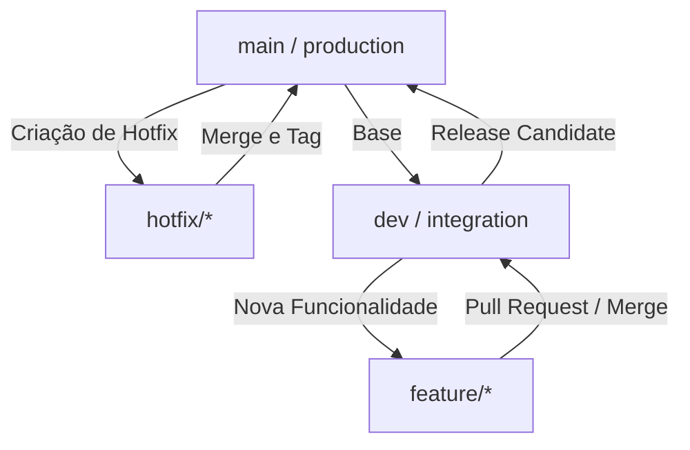

# Diretrizes de Contribuição e Versionamento - OrçaBrindes

Para manter o repositório organizado, seguro e preparado para futuras automações (como CI/CD, geração automática de CHANGELOG e versionamento automático), adotamos dois padrões principais de desenvolvimento: **Git Flow** para gerenciamento de ramificações (branches) e **Conventional Commits** para padronização de mensagens de commit.

---

## 1. Fluxo de Trabalho de Branches (Git Flow)

Trabalhamos com ramificações estruturadas para garantir a estabilidade do código em produção:



### Ramificações Principais
- **`main`**: Reflete o código atualmente em produção. O código aqui deve ser 100% estável. Tags de versão (ex: `v1.0.0`) são criadas a partir desta branch.
- **`dev`**: Ramificação principal de integração de desenvolvimento. Todas as novas features devem ser mescladas aqui antes de irem para a `main`.

### Ramificações de Suporte
- **`feature/nome-da-feature`**: Usada para desenvolver novos recursos. É criada a partir de `dev` e, ao finalizar, é mesclada de volta em `dev`.
  * *Exemplo*: `feature/cadastro-clientes`
- **`hotfix/descricao-do-bug`**: Usada para correções urgentes diretamente em produção (`main`). É criada a partir de `main` e, após a correção, deve ser mesclada na `main` e também na `dev` (para manter ambas sincronizadas).
  * *Exemplo*: `hotfix/erro-login`

---

## 2. Padrão de Commits (Conventional Commits)

Todas as mensagens de commit devem seguir a especificação dos **Conventional Commits**. Isso permite ler o histórico facilmente e automatizar a geração do arquivo `CHANGELOG.md`.

### Estrutura do Commit:
```text
<tipo>(<escopo opcional>): <descrição curta em minúsculas>

[corpo explicativo opcional]

[rodapé opcional para fechar issues]
```

### Principais Tipos (`type`):
- **`feat`**: Introdução de uma nova funcionalidade no sistema.
  * *Exemplo*: `feat(produtos): adiciona upload de multiplas imagens para a galeria`
- **`fix`**: Correção de um bug ou comportamento incorreto.
  * *Exemplo*: `fix(orcamentos): corrige calculo de desconto na escala de precos`
- **`docs`**: Alterações apenas na documentação (como README.md ou arquivos de ajuda).
  * *Exemplo*: `docs: atualiza instruções de execucao no readme`
- **`style`**: Mudanças de estilo visual ou formatação de código que não alteram a lógica (espaços, formatação, ponto e vírgula, CSS puramente estético).
  * *Exemplo*: `style(painel): ajusta alinhamento do botao de salvar`
- **`refactor`**: Alterações de código que não corrigem bugs nem adicionam funcionalidades, mas melhoram a estrutura ou performance.
  * *Exemplo*: `refactor(auth): simplifica middleware de autenticacao`
- **`test`**: Adição ou modificação de testes existentes.
  * *Exemplo*: `test(produtos): adiciona testes unitarios para faixas de preco`
- **`chore`**: Tarefas de manutenção do projeto (atualização de dependências, builds, configurações do Git, variáveis de ambiente).
  * *Exemplo*: `chore: adiciona variavel de versao no env.example`

---

## 3. Como Criar uma Nova Versão (Release)

Sempre que decidir gerar uma nova versão oficial do sistema (por exemplo, `v1.1.0`):

1. Certifique-se de que todas as novas funcionalidades da branch `dev` foram testadas e aprovadas.
2. Mescle a branch `dev` na branch `main`:
   ```bash
   git checkout main
   git merge dev
   ```
3. Crie uma tag anotada com a nova versão seguindo o versionamento semântico (MAJOR.MINOR.PATCH):
   ```bash
   git tag -a v1.1.0 -m "Release v1.1.0: Nova funcionalidade de X e correções em Y"
   ```
4. Atualize a variável `APP_VERSION=1.1.0` no arquivo `.env` de produção.
5. Envie a tag e as alterações para o repositório remoto:
   ```bash
   git push origin main --tags
   ```
