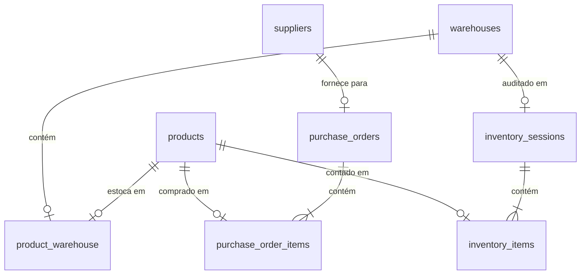

# Implementation Plan - Professional Stock & Procurement System (Stock Control V2)

Este plano detalha a expansão e profissionalização do Controle de Estoque, cobrindo depósitos múltiplos, fornecedores, ordens de compra, check-in de recebimento, preço de custo, valor financeiro de estoque, sessões de inventário físico e lançamentos manuais estruturados.

---

## Proposed Database Changes

### Novas Tabelas e Relacionamentos

1. **Campos novos em `products`**:
   - `minimum_stock` (integer, padrão 0): Para alertas e sugestões de compra.
   - `cost_price` (decimal, 10,2, padrão 0.00): Preço de custo/compra para cálculo de valor patrimonial do estoque e margens.
2. **`warehouses` (Depósitos)**:
   - `id`, `name` (ex: Depósito Central, Showroom), `code` (string única), `description`, `is_active` (boolean).
3. **`product_warehouse` (Estoque por Depósito)**:
   - `product_id` (FK), `warehouse_id` (FK), `quantity` (integer). Chave primária composta `(product_id, warehouse_id)`.
4. **`suppliers` (Fornecedores)**:
   - `id`, `name`, `cnpj`, `email`, `phone`, `contact_name`.
5. **`purchase_orders` (Ordens de Compra)**:
   - `id`, `supplier_id` (FK), `po_number` (string única), `status` (`Rascunho`, `Aprovado`, `Recebido`, `Cancelado`), `total_amount` (decimal), `observations`, `created_by` (FK para `users`), `received_at` (datetime).
6. **`purchase_order_items` (Itens da Ordem)**:
   - `id`, `purchase_order_id` (FK), `product_id` (FK), `quantity` (integer), `price` (decimal, custo de compra), `received_quantity` (integer, default 0).
7. **`inventory_sessions` (Inventários/Conferências)**:
   - `id`, `warehouse_id` (FK), `status` (`Em_Andamento`, `Finalizado`, `Cancelado`), `description`, `created_by` (FK), `completed_at` (datetime).
8. **`inventory_items` (Itens do Inventário)**:
   - `id`, `inventory_session_id` (FK), `product_id` (FK), `expected_quantity` (integer, estoque do sistema), `counted_quantity` (integer, contagem física), `adjusted_quantity` (integer, delta calculado).

---

## Proposed Changes

### 1. Migrações de Banco de Dados [NEW]
- Criar migração para adicionar `minimum_stock` e `cost_price` em `products`.
- Criar migração para `warehouses` e `product_warehouse` pivot.
- Criar migração para `suppliers`, `purchase_orders` e `purchase_order_items`.
- Criar migração para `inventory_sessions` e `inventory_items`.
- Modificar `stock_movements` para suportar `warehouse_id`, `purchase_order_id` / `inventory_session_id`, e `cost_price` histórico.

### 2. Models do Laravel [NEW/MODIFY]
- **`Product.php`**: Atualizar relacionamento para suportar múltiplos depósitos (`warehouses()`) e obter totalizadores de estoque e relatórios financeiros (Custo Total do Estoque vs. Valor Potencial de Venda).
- **`Warehouse.php`**: Model para depósitos.
- **`Supplier.php`**: Model para fornecedores.
- **`PurchaseOrder.php`** / **`PurchaseOrderItem.php`**: Models para Ordens de Compra e itens.
- **`InventorySession.php`** / **`InventoryItem.php`**: Models para controle de contagens físicas e reconciliações.
- **`StockMovement.php`**: Adicionar relações com depósitos, compras e preço de custo histórico.

### 3. Lógica e Serviços do Backend [NEW/MODIFY]
- **`StockService.php`**:
  - Modificar `adjustStock` para receber o `warehouse_id` específico e registrar se é entrada/saída manual.
  - Atualizar regras de orçamentos para debitar do "Depósito Padrão" (definido nas configurações ou primeiro depósito cadastrado).
  - Implementar `receivePurchaseOrderItems(PurchaseOrder $po, array $itemsReceived)`: Processa o check-in das ordens de compra, soma as quantidades recebidas nos depósitos correspondentes e gera logs de auditoria.
  - Implementar `reconcileInventory(InventorySession $session)`: Finaliza o inventário aplicando as contagens físicas, ajustando os depósitos e gerando movimentações corretivas.

### 4. Controllers e APIs Administrativas [NEW]
- **`SupplierController.php`**: CRUD simples de fornecedores.
- **`WarehouseController.php`**: CRUD simples de depósitos.
- **`PurchaseOrderController.php`**:
  - CRUD de Ordens de Compra.
  - Ação `checkin(Request $request, PurchaseOrder $po)`: Tela de check-in para entrada de mercadorias.
  - Ação `suggestions()`: API/Tela que lê produtos abaixo do estoque mínimo e sugere compras agrupadas por fornecedor cadastrado.
- **`InventoryController.php`**:
  - Inicia sessões de inventário para um depósito específico.
  - Registra contagens dos itens em andamento (`conferência`).
  - Finaliza reconciliações de estoque.
- **`StockController.php`**:
  - Index: Retorna saldos consolidados, saldos por depósito, histórico detalhado, e **relatório financeiro simplificado (Custo total em estoque vs. Valor potencial de venda)**.
  - Ação `manualMovement()`: Endpoint para realizar lançamentos manuais estruturados de entrada e saída (com escolha de Depósito, Produto, Tipo [Entrada/Saída], Quantidade e Justificativa).

### 5. Frontend - Telas de Gestão Administrativa [NEW]
- **`Stock/Index.vue` [MODIFY]**: Expandir para incluir:
  - Abas ou seções para: "Saldos por Depósito", "Lançamentos Manuais de Entrada e Saída", "Histórico Geral" e "Visão Financeira".
  - **Relatório Financeiro**: Cards modernos exibindo o *Custo Total do Estoque*, *Valor de Venda do Estoque* e a *Margem Média Estimada*.
- **`Stock/ManualMovementForm.vue` [NEW]**: Formulário ou modal dedicado para lançamentos manuais estruturados de entrada e saída de estoque.
- **`Stock/PurchaseSuggestions.vue` [NEW]**: Painel de sugestões de reabastecimento. Permite selecionar itens abaixo do mínimo e gerar Ordens de Compra rascunho com 1 clique.
- **`PurchaseOrders/Index.vue`, `Create.vue`, `Edit.vue` [NEW]**: Listagem e fluxo completo de criação de Ordens de Compra.
- **`PurchaseOrders/CheckIn.vue` [NEW]**: Interface de recebimento de carga (Check-in), permitindo bipar ou digitar a contagem de itens que estão entrando no depósito.
- **`Inventory/Index.vue`, `Show.vue` [NEW]**: Interface de auditoria e contagem física (Inventários). Exibe o delta em tempo real durante a conferência.
- **`Warehouses/Index.vue` & `Suppliers/Index.vue` [NEW]**: Telas simples de cadastro de depósitos e fornecedores.

---

## Verification Plan

### Automated Tests
- Executar `npm run build` para garantir a compilação perfeita de todas as novas rotas e componentes de compras e inventários.

### Manual Verification
1. **Configuração de Depósito**: Criar dois depósitos (ex: "Depósito Principal" e "Loja física").
2. **Lançamento Manual**: Realizar entrada e saída manual no formulário dedicado, especificando o depósito e justificativa.
3. **Visão Financeira**: Informar preço de custo nos produtos e checar se o dashboard de estoque exibe corretamente o valor patrimonial.
4. **Sugestão & Ordem de Compra**:
   - Cadastrar produto com estoque mínimo de 20 e estoque atual de 5.
   - Acessar "Sugestões de Compra", verificar o produto na lista, selecionar e clicar em "Gerar Ordem de Compra".
5. **Check-in de Recebimento**:
   - Fazer check-in recebendo os itens. Verificar se o estoque do depósito selecionado aumenta de acordo com a quantidade entrada.
6. **Inventário/Conferência**:
   - Abrir inventário para o "Depósito Principal".
   - Alterar contagem de canecas de 50 para 48 (delta -2).
   - Finalizar inventário e checar se o estoque do produto no depósito é ajustado para 48.
